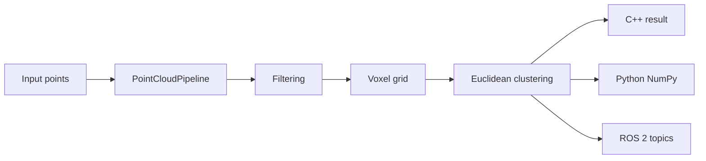

# Parallax (point-cloud)

Parallax is a C++20 LiDAR point-cloud processing pipeline. The core pipeline does
three things:

1. Filters invalid points, applies pass-through bounds, and can remove statistical outliers.
2. Downsamples with a hash-based voxel grid using voxel centroids.
3. Segments the downsampled cloud with Euclidean clustering.

The repo also includes Python bindings and a ROS 2 wrapper package.

## Repository Layout

```text
include/                  Public C++ headers
src/                      Shared library implementation
python/                   pybind11 bindings
ros2/pointcloud_pipeline_ros/
                           ROS 2 wrapper package
tests/                    C++ and Python tests
benchmarks/               Synthetic LiDAR benchmark
examples/                 Small C++ and Python examples
docs/                     Architecture and performance notes
```

## Architecture

The important design choice is that all real processing lives in the shared C++
library. Python and ROS 2 only convert data at the boundary.



The main API is:

```cpp
pointcloud_pipeline::PointCloudPipeline pipeline(config);
pointcloud_pipeline::PipelineResult result = pipeline.process(points);
```

## Native Build

```bash
cmake -S . -B build -DCMAKE_BUILD_TYPE=Release
cmake --build build --config Release
ctest --test-dir build --output-on-failure
```

## Python Build and Usage

```bash
python -m pip install pybind11 numpy pytest
cmake -S . -B build -DCMAKE_BUILD_TYPE=Release
cmake --build build --target pointcloud_pipeline_py --config Release
```

## ROS 2 Usage

```bash
source /opt/ros/humble/setup.bash
cd ros2
colcon build --cmake-args -DCMAKE_PREFIX_PATH=$OLDPWD/install
source install/setup.bash
ros2 launch pointcloud_pipeline_ros pipeline.launch.py
```

## Benchmarks

```bash
./build/pointcloud_pipeline_benchmark --update-readme
```

<!-- BENCHMARK_TABLE_BEGIN -->
| Points | Baseline mean ms | Downsampled mean ms | Baseline P95 ms | Downsampled P95 ms | Speedup |
|---:|---:|---:|---:|---:|---:|
| 100000 | 184.00 | 37.11 | 562.30 | 39.28 | 4.96x |
| 250000 | 226.33 | 72.02 | 246.19 | 85.39 | 3.14x |
| 500000 | 538.94 | 234.55 | 559.70 | 255.75 | 2.30x |
| 1000000 | 1020.39 | 509.63 | 1192.57 | 572.27 | 2.00x |
<!-- BENCHMARK_TABLE_END -->

## Testing and Coverage

```bash
ctest --test-dir build --output-on-failure
```

## CUDA Backend

An optional `POINTCLOUD_PIPELINE_USE_CUDA` CMake flag is wired in. Host stubs
currently report no device until the GPU kernels land.

Thrust kernels now handle pass-through filtering and voxel downsampling;
clustering still runs on the CPU.
