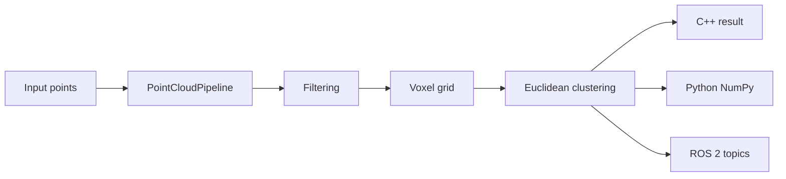

# Parallax (point-cloud)

Parallax is a C++20 LiDAR point-cloud processing pipeline with an optional CUDA path.

The core pipeline does three things:

1. Filters invalid points, applies pass-through bounds, and can remove statistical outliers.
2. Downsamples with a hash-based voxel grid using voxel centroids.
3. Segments the downsampled cloud with Euclidean clustering.

The repo also includes Python bindings and a ROS 2 wrapper package. They have not been built or tested in the environment used for the results below (see [Python Build and Usage](#python-build-and-usage) and [ROS 2 Usage](#ros-2-usage)).

## Repository Layout

```text
include/                  Public C++ headers
src/                      Shared library implementation
src/cuda/                 Optional CUDA preprocess (filter + voxel)
python/                   pybind11 bindings
ros2/pointcloud_pipeline_ros/
                           ROS 2 wrapper package
tests/                    C++ and Python tests
benchmarks/               Synthetic LiDAR benchmark
examples/                 Small C++ and Python examples
docs/                     Architecture, performance, and CUDA notes
```

## Architecture

The important design choice is that all real processing lives in the shared C++
library. Python and ROS 2 only convert data at the boundary.



The main API is:

```cpp
pointcloud_pipeline::PointCloudPipeline pipeline(config);
pointcloud_pipeline::PipelineResult result = pipeline.process(points);
```

## Native Build

```bash
cmake -S . -B build -DCMAKE_BUILD_TYPE=Release
cmake --build build --config Release
ctest --test-dir build --output-on-failure
```

The build uses `-Wall -Wextra -Wpedantic` on GCC/Clang and `/W4` on MSVC. Open3D,
pybind11, and CUDA are detected when installed. The core C++ library and tests
still build without them.

## Python Build and Usage

> Status: the bindings are in source but have not been built or tested in the environment used for the results above.

Install pybind11 and NumPy in the Python environment CMake will find:

```bash
python -m pip install pybind11 numpy pytest
cmake -S . -B build -DCMAKE_BUILD_TYPE=Release
cmake --build build --target pointcloud_pipeline_py --config Release
```

## ROS 2 Usage

> Status: the ROS 2 package is in source but has not been built or run in the environment used for the results above.

```bash
source /opt/ros/humble/setup.bash
cd ros2
colcon build --cmake-args -DCMAKE_PREFIX_PATH=$OLDPWD/install
source install/setup.bash
ros2 launch pointcloud_pipeline_ros pipeline.launch.py
```

## CUDA Backend

The optional CUDA path uses Thrust (`copy_if`, `sort_by_key`, `reduce_by_key`) to accelerate pass-through filtering and voxel downsampling on NVIDIA GPUs, then runs Euclidean clustering on the CPU. Build with `-DPOINTCLOUD_PIPELINE_USE_CUDA=ON` when the CUDA toolkit is installed.

See `docs/cuda.md` for architecture notes, parity tests, and benchmark commands.

## Benchmarks

```bash
./build/pointcloud_pipeline_benchmark --update-readme
./build/Release/pointcloud_pipeline_benchmark --cuda --update-readme
```

CPU voxel downsampling vs baseline (Windows, MSVC Release):

<!-- BENCHMARK_TABLE_BEGIN -->
| Points | Baseline mean ms | Downsampled mean ms | Baseline P95 ms | Downsampled P95 ms | Speedup |
|---:|---:|---:|---:|---:|---:|
| 100000 | 184.00 | 37.11 | 562.30 | 39.28 | 4.96x |
| 250000 | 226.33 | 72.02 | 246.19 | 85.39 | 3.14x |
| 500000 | 538.94 | 234.55 | 559.70 | 255.75 | 2.30x |
| 1000000 | 1020.39 | 509.63 | 1192.57 | 572.27 | 2.00x |
<!-- BENCHMARK_TABLE_END -->

CUDA hybrid path (same machine: CUDA 13.3, NVIDIA GeForce RTX 5070 Laptop GPU):

<!-- CUDA_BENCHMARK_TABLE_BEGIN -->
| Points | CPU mean ms | GPU total mean ms | GPU compute mean ms | H2D+D2H mean ms | Speedup |
|---:|---:|---:|---:|---:|---:|
| 100000 | 15.00 | 22.83 | 4.75 | 2.64 | 0.66x |
| 250000 | 61.05 | 50.94 | 6.79 | 5.45 | 1.20x |
| 500000 | 207.85 | 151.91 | 10.22 | 12.81 | 1.37x |
| 1000000 | 579.07 | 444.44 | 32.04 | 23.83 | 1.30x |
<!-- CUDA_BENCHMARK_TABLE_END -->

## Testing and Coverage

```bash
ctest --test-dir build --output-on-failure
```

## KITTI I/O

`loadKittiBin` reads Velodyne `.bin` scans (x, y, z, intensity float32 records).
A tiny fixture test is in place; real-scan timing tables land once the benchmark
`--kitti` path is wired.
